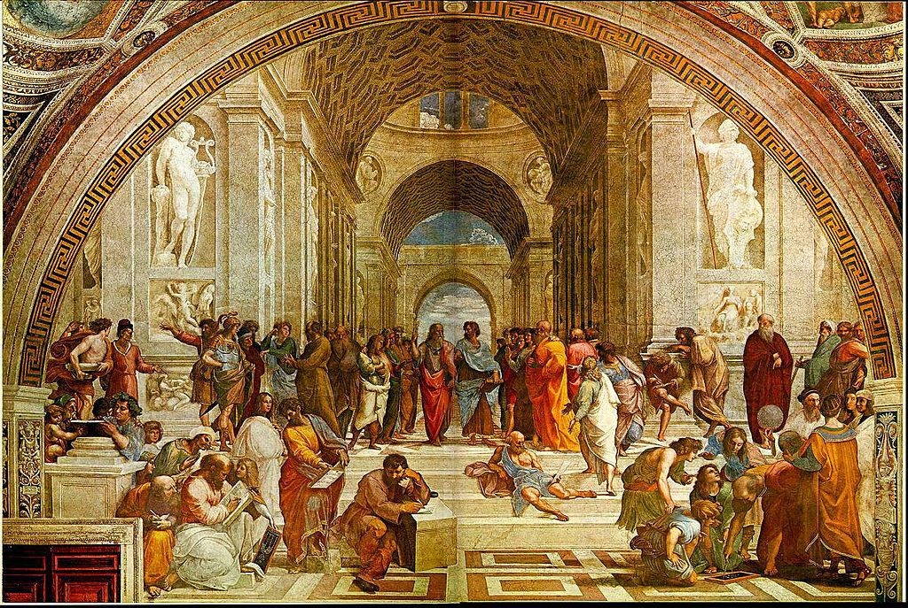

#+TITLE: Sample Presentation

# Edit this file, then M-x rlr/org-export-to-touying-content to
# regenerate content.typ -- don't hand-edit content.typ, since
# re-exporting will overwrite it. Conventions:
#
#   * Section     -> `= Section` (its own section slide)
#   ** A slide     -> `== A slide` (a frame -- no wrapper needed for
#                     plain body text)
#   #+begin_speakernote ... #+end_speakernote -> #speaker-note[...]
#   #+begin_handoutnote ... #+end_handoutnote -> #handout-note[...]
#   @@typst:#pause@@ -> a progressive reveal
#   #+begin_columns containing two #+begin_column ... #+end_column
#     blocks -> #two-column-slide[...][...]
#   #+begin_fullslide ... #+end_fullslide -> #full-slide(...); a lone
#     image link inside becomes a full-bleed image

* Components

** Basic Theme

- Simple theme for Touying
- Uses sections and optional subsections
- White, black, and gray color variants

#+begin_speakernote
This is a speaker note viewable on second screen.
#+end_speakernote

#+begin_handoutnote
Handout notes appear only on the article style handout.

The theme is a replication of a Beamer theme that I created and have used for years. It has space on the title slide for an optional logo, but displays fine without the logo. The default configuration is white slides without subsections.
#+end_handoutnote

** Touying-Scaffold

- Provides Emacs command to generate an initial presentation template
- Asks for desired directory
- Creates folder and files
- Opens content file in Org mode

#+begin_handoutnote
This provides an Emacs command that scaffolds the required files in a new folder. The include an Org file, a config file, a Typst content file, and the two Typst files that are compiled to produce the slide deck and the handout.
#+end_handoutnote

** Ox-Touying

- Custom exporter
- Exports ~talk.org~ to ~content.typ~

#+begin_speakernote
When using Org mode, content.typ is never directly editied.
#+end_speakernote

#+begin_handoutnote
Ox-Typst works great for articles, but did not for my presentations. Ox-Touying is a custom exporter that exports Org files to the Typst format that is required by the theme. The exporter is not required, content.typ can be edited directly. When using Org Mode, however, there is no need to open content.typ
#+end_handoutnote

* Creating a Presentation

** Emacs Command

- ~M-x rlr/new-touying-presentation~
- Asks for  title and folder
- Creates folder with files

** Files

1. ~talk.org~
2. ~content.typ~
3. ~config.typ~
4. ~<slug>-slides.typ~
5. ~<slug>-handout.typ~

#+begin_speakernote
1. Org mode content file
2. Typst content file (not edited)
3. Configuration file (edited only to change color, logo, and sectioning)
4. File compiled to produce slides
5. File compiled to produce handout
#+end_speakernote

#+begin_handoutnote
Five files are created by the Emacs command. They are:

1. An Org mode file that contains the content for the presentation.
2. A Typst file that is exported from the org mode file. This can be edited directly if the user wants to use only Typst and not Org mode. When Org mode is used, however, this file is never directly edited. 
3. A configuration file that is rarely edited. The only changes that need to be made to it are if the user  needs to change the logo, change the slide colors, or is giving a talk that requires subsections. 
4. This is the file that is compiled to produce the slides. 
5. This is the file that is compiled to produce the handout.

Files four and five have names that are made from the presentation title. This means that the compiled PDFs will also have names that reflect the presentation title. This makes it easier to find the relevant PDF files using a computer search tool. 
#+end_handoutnote

** Writing Content

- Headings
    - Level 1: sections
    - Level 2: subsections or slide titles
    - Level 3: slide titles
- Other text: slide content

#+begin_speakernote
- Headings make the section slides, subsection slides, and slide titles.
- Text below a slide title becomes slide content. 
#+end_speakernote

#+begin_handoutnote
Level one headings are always section titles. They become a formatted section page in the slide deck. If using the default configuration, level two headings become slide titles. When using the subsection option, level two headings are subsection titles, and level three headings become slide titles. Normal text underneath a level three heading becomes slide contents. Speaker and handout notes are always wrapped in the relevant begin/end blocks. Note that, although speaker notes and handout notes are both in the same content file, they only compile to their relevant PDF. That is, speaker notes are compiled to the slides, and handout notes are compiled only to the handout. . 
#+end_handoutnote

** Revealing Content

- Use ~@@typst:#pause@@~ @@typst:#pause@@
- Functions like the Beamer ~\pause~ command

#+begin_handoutnote
As in Beamer, this essentially produces separate slides. It is especially useful for keeping students' attention during the lecture, preventing them from focusing on writing down the entire slide information  as the instructor is speaking. 
#+end_handoutnote

** Layout Blocks

- Used for special cases
    - Two-column slides
    - Full frame slides with no titles
    - Slides with a short main point centered in the slide

#+begin_speakernote
Code examples for each are included in the handout. 
#+end_speakernote

#+begin_handoutnote
Most slides are bulleted or numbered lists, but I do sometimes need some layouts that plain prose can't quite capture. There are three more  ~#+begin_...#+end~ blocks to cover those cases.
#+end_handoutnote

** Two Column

#+begin_columns
#+begin_column
  - *Column A*
  - Text
#+end_column
#+begin_column
  - *Column B*
  - Text
#+end_column
#+end_columns

#+begin_speakernote
- Wrapped in begin/end blocks
- Next slide: full-frame image
#+end_speakernote

#+begin_handoutnote
Two-column slides  are produced like this:

#+begin_src org
  ,** Slide Title

  ,#+begin_columns
  ,#+begin_column
    - *Column A*
        - Text
  ,#+end_column
  ,#+begin_column
    - *Column B*
    - Text
  ,#+end_column
  ,#+end_columns

The next slide is a full-frame image.
#+end_src
#+end_handoutnote

** The School of Athens

#+begin_fullslide

#+end_fullslide

#+begin_speakernote
Full-frame image, no title, no margins
#+end_speakernote

#+begin_handoutnote
This produces a full-frame image, no title, no margins:

#+begin_src org
,** The School of Athens

,#+begin_fullslide

,#+end_fullslide
#+end_src

A lone image inside ~#+begin_fullslide~ is automatically sized to cover the whole slide. That's fine for an image that is close to the 16:9 landscape slide format. If a specific size is desired instead, an ~#+ATTR_TOUYING:~ line right before the image link overrides that:

#+begin_src org
,#+begin_fullslide
,#+ATTR_TOUYING: :width 60% :height 300pt :fit "contain"

,#+end_fullslide
#+end_src

The same ~#+ATTR_TOUYING:~ mechanism works on any image, full-bleed or not;  ~:width~, ~:height~, and ~:fit~ pass straight through to Typst's ~image()~, and ~:align~ (e.g. ~center~, ~center + horizon~) wraps the image so it's centered in its container, since alignment belongs to the surrounding box in Typst, not to the image itself:

#+begin_src org
,#+ATTR_TOUYING: :width 40% :align center
[[file:diagram.png]]
#+end_src
#+end_handoutnote

** Main Point Slides

#+begin_fullslide
#+ATTR_TOUYING: :size 2em
#+begin_statement
*Main Point Slides*
#+end_statement
#+end_fullslide

#+begin_speakernote
- Big centered statement slide
#+end_speakernote

#+begin_handoutnote
And last, a big centered "statement" slide -- the kind of slide that's just one line, large, in the middle of an otherwise empty frame, for the one claim in a lecture I want to land without any visual clutter around it:

#+begin_src org
,#+begin_fullslide
,#+ATTR_TOUYING: :size 2.5em
,#+begin_statement
Main Point Slides
,#+end_statement
,#+end_fullslide
#+end_src

Nested inside ~#+begin_fullslide~ like that, the frame has no title at all -- just the sentence, centered both horizontally and vertically, at whatever size ~:size~ asks for (~2em~ if omitted). Left outside a ~fullslide~, the same block still centers its text but leaves the
frame's title showing above it.
#+end_handoutnote

* Finishing

** Compiling

- Options
    - ~typst compile~ shell command
    - ~Custom shell command~
    - Emacs function

#+begin_speakernote
Code is included in the handout.
#+end_speakernote

#+begin_handoutnote
Once ~talk.org~ says what I want, ~M-x rlr/org-export-to-touying-content~
regenerates ~content.typ~, and then it's ordinary Typst:

#+begin_src sh
typst compile my-talk-slides.typ    # what I present from
typst compile my-talk-handout.typ   # what students get afterward
#+end_src

I use this Fish function to compile both and open the respective PDF files without Emacs losing focus:

#+begin_src fish
function compile-touying-deck --description 'typst compile the *slides.typ and *handout.typ files in a directory'
    set -l dir .
    if test (count $argv) -gt 0
        set dir $argv[1]
    end

    if not test -d $dir
        echo "compile-touying-deck: not a directory: $dir" >&2
        return 1
    end

    set -l files (find $dir -maxdepth 1 -type f \( -name '*slides.typ' -o -name '*handout.typ' \) | sort)

    if test (count $files) -eq 0
        echo "compile-touying-deck: no *slides.typ or *handout.typ files found in $dir" >&2
        return 1
    end

    set -l failed 0
    for file in $files
        echo "Compiling $file..."
        if not typst compile $file
	  set failed 1
        end
    end
    wait
    open -g *.pdf

    return $failed
end
#+end_src

There is, of course, no need to leave Emacs for the shell.

#+begin_src emacs-lisp
(defun compile-typst-lecture ()
  "Compiles the slides.typ and handout.typ files in the directory."
  (interactive)
    (shell-command "compile-touying-deck"))
#+end_src

Even better is to export, compile, and open the PDF files with a single command:

#+begin_src emacs-lisp
  (defun rlr/org-mktouying ()
      (interactive)
  (rlr/org-export-to-touying-content)
  (compile-typst-lecture))
#+end_src

The slide deck paginates normally, respects the progressive reveals, and shows speaker notes on a second screen. The handout collapses the whole thing into one flowing document -- no pagination, headings numbered (1, 1.1, 1.2, ...), and a plain line above each handout note marking where the text stops being something the audience actually saw and starts being added context for the reader.

#+end_handoutnote

** Github Repository

#+ATTR_TOUYING: :size 2.5em
#+begin_statement
[[https://github.com/rlridenour/touying-basic-theme][Link Here!]]
#+end_statement

#+begin_speakernote
[[https://github.com/rlridenour/touying-basic-theme]]
#+end_speakernote

#+begin_handoutnote
The code and sample presentation is at [[https://github.com/rlridenour/touying-basic-theme]].
#+end_handoutnote

